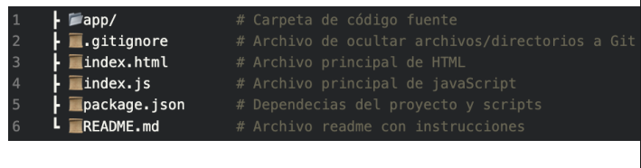

## PROYCTO FINAL DE UNA PAGINA SPA

Este proyecto es una Single Page Application (SPA) para la gestión de eventos, cumpliendo con todos los requisitos del enunciado: autenticación con roles, rutas protegidas, persistencia de sesión, y CRUD completo.

## INFORMACION DEL AUTHOR:

- **Nombre completo:** Sebastian Pereira
- **Clan:** Manglar

## ESTRUCTURA DEL PROYECTO



## 🚀 ¿Cómo ejecutar la solución se ejecuta?

# ¡PASOS A SEGUIR!

1. Asegúrate de tener `json-server` instalado globalmente:

```
npm install -g json-server
```

2. En la raíz del proyecto, ejecuta:

```
json-server --watch db.json --port 3000
```

3. Abre `index.html` en tu navegador.
  *NOTA: Tambien es posible usar una extension de visual studio code "Live Server"*

## ✅ Funcionalidades implementadas

- Registro e inicio de sesión con roles (admin / visitante)
- Persistencia de sesión con LocalStorage
- Rutas protegidas con router.js
- CRUD completo de eventos (crear, editar, eliminar)
- Registro de visitantes a eventos (si hay cupo)
- Vista personalizada para cada rol
- Redirección según sesión
- Estilo simple, responsivo y limpio

---

*THANKS FOR VISIT MY PROYECT :)*
